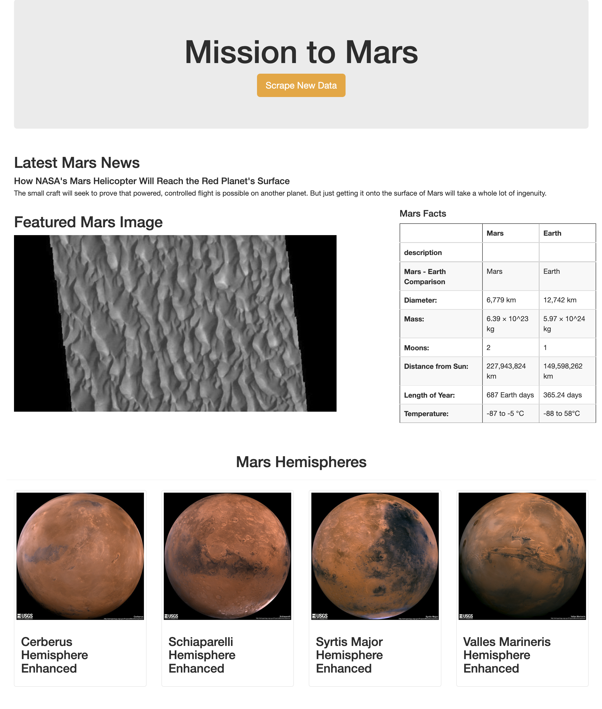

# Mission-to-Mars

## Overview

For this project, I utilized HTML, Bootstrap, Python, BeautifulSoup, Splinter, Flask, and MongoDB to create a web application to perform automated web scraping from mulitiple sources of Mars-related information on the internet and display the results on a web page using HTML with Bootstrap. 

## Scraping High-Resolution Mars Hemisphere Images and Titles

For the first deliverable (in *Mission_to_Mars_Challenge.ipynb*) of the challenge, I created a loop using Python (with Splinter and BeautifulSoup) to scrape full size mars hemisphere images from a Mars hemispheres [website](https://marshemispheres.com). The loop resulted in a list of dictionaries containing the hemishpere images urls paired with their respective titles. 

## Updating the Web App with Mars Hemisphere Images and Titles

For the second deliverable (in *scraping.py* and *templates/index.html*) of the challenge, I added the hemisphere images and titles scraping loop code to the *scraping.py* script by creating a new function, called *hemispheres()*. This function contains the loop and returns a list of dictionaries with each dictionary element containing a key-value pair for the image url and title. The *hemispheres()* function is called within the  *scrape_all()* function (in the *scraping.py* script) returning the hemispheres dictionary list in a nested dictionary inside the scraping function's data dictionary. The *scrape_all()* function is imported to the *app.py* flask app used to set up the scraping web application. Here, a connection is made to the 'mars' database I created in MongoDB. All of the scraped data, returned as a dictionary of nested dictionaries by the *scrape_all()* function, is collected and stored in the MongoDB database. The web application accesses the data to display on the page from the latest entry in the MongoDB database. The *index.html* file contains the HTML and Bootstrap encoded template that the flask application uses to visually render the website. 

## Adding Bootstrap 3 Components

For the third deliverable (in *index.html* and *scraping.py*) of the challenge, I used the Bootstrap grid system to ensure the website is 'mobile responsive', and I added extra bootstrap components to further style the application visually. After confirming the page was 'mobile responsive', I included three main modifications to the elements on the page using bootstrap. First, I made the four hemisphere images into thumbnails, each occuying a column of the bootstrap grid while all sitting in a single row (on the desktop rendering). Second, I changed the button class for the 'Scrape New Data' button, from 'Primary' to 'Warning', to display the button in a more eye-catching light orange. The 'warning' color may also indicate that pressing it will alter some of the contents displayed on the page. Third, I modified the return statement of the *mars_facts()* function in *scraping.py* to add the 'table-hover' class to the HTML encoding of the 'Mars Facts' data table. The 'table-hover' class will enable a hover state on the table rows, so the table row that the cursor is hovering over will be highlighted.  

## 'Mission to Mars' Scraping Web App (Static Sample Image)

*screen shot of the functioning 'Mission to Mars' website (desktop)*